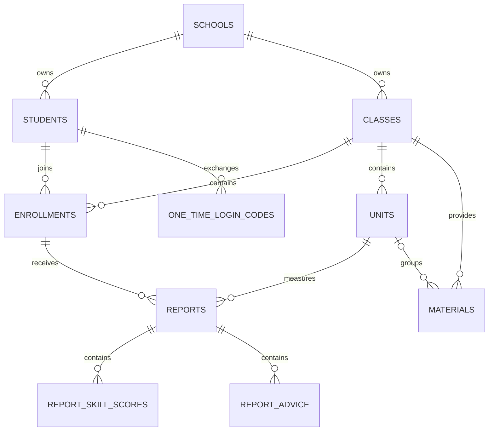

# Thiết kế PostgreSQL

## Mô hình dữ liệu

`enrollments.is_active` là trạng thái lớp của riêng từng học sinh. `reports` tham
chiếu đồng thời enrollment, class và unit bằng khóa ghép, nên database từ chối dữ
liệu chéo lớp. Bảy kỹ năng là enum ổn định; điểm mỗi kỹ năng tách thành hàng để dễ
thêm thống kê và index mà không phải đổi cấu trúc JSON.

## Khả năng mở rộng

- Mọi dữ liệu nghiệp vụ có đường dẫn về `school_id`, sẵn sàng tách tenant hoặc
  partition khi có nhiều trường.
- UUID tránh phụ thuộc sequence giữa các môi trường và vẫn được trả thành string
  đúng API. Các index bám theo truy vấn student/class/unit thay vì index mọi cột.
- PostgreSQL lưu metadata và kết quả. PDF/audio/video nằm ở object storage; bảng
  `materials` chỉ giữ `object_key` và metadata.
- Với hàng trăm học sinh, schema này rất nhỏ. Chỉ partition report/audit khi đạt
  hàng chục triệu dòng; trước đó partition gây nhiều chi phí hơn lợi ích.
- API dùng Neon pooled connection; migration và tác vụ quản trị dùng direct
  connection. Khởi đầu giới hạn pool 10–20 connection cho ASP.NET Core.

## Bảo mật

- `essadmin` là database owner dùng cho migration, không đưa connection string vào
  frontend hay GitHub Pages.
- Production API nên có login role riêng và được cấp group role `ess_api` bằng
  migration `002_runtime_permissions.sql`.
- Chỉ lưu password hash Argon2id/BCrypt. One-time code chỉ lưu SHA-256 và được đánh
  dấu `used_at` trong cùng transaction kiểm tra hạn dùng.
- Mỗi endpoint phải join enrollment để kiểm tra quyền; UUID không thay thế kiểm tra
  quyền đối tượng.

Migration nguồn nằm trong [`database/migrations`](../database/migrations/).
